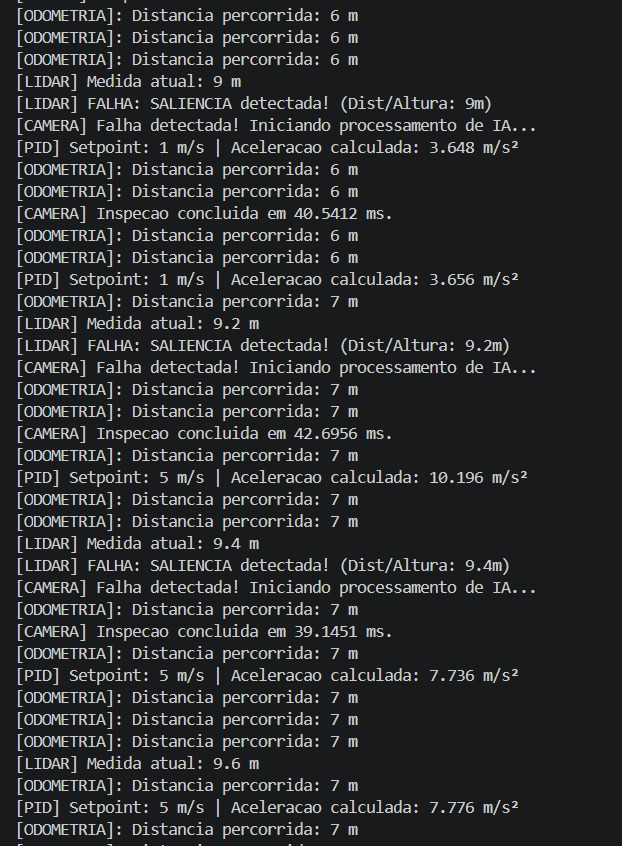

\begin{titlepage}
    \centering

    {\large \textbf{Universidade Federal de Minas Gerais (UFMG)} \par}
    {\large Engenharia de Controle e Automação} \par
    
    \vspace{4cm} 
    
    {\LARGE \textbf{Sistema Automatizado de Inspeção de Túneis} \par}
    \vspace{0.6cm} 
    {\large Trabalho Final - Automação em Tempo Real - Etapa 1 \par}
    
    \vspace{4.5cm} 
    
    {\large \textbf{Alunos:} \par}
    \vspace{0.4cm}
    {Ana Beatriz Soares Cardoso -- 2022108170 \par}
    {Julia Pereira Maia Ribeiro -- 2021014864 \par}
    {Pedro Eduardo Alvino Tapia -- 2021031084 \par}
    
    \vfill 

    {\large Belo Horizonte \par}
    {\large 2026 \par}
\end{titlepage}

\thispagestyle{empty}
\newpage              

\vspace*{0cm}         
\tableofcontents     
\newpage              

\pagenumbering{arabic} 
\setcounter{page}{1}   


# Introdução
O monitoramento e a manutenção preventiva de infraestruturas críticas subterrâneas, como túneis rodoviários e metroviários, apresentam desafios severos de segurança operacional e eficiência de inspeção. Tradicionalmente, a identificação de anomalias estruturais, tais como falhas na superfície do teto, infiltrações ou deformações geométricas, depende de inspeções visuais manuais intermitentes, as quais expõem os operadores a ambientes de risco e demandam a interrupção prolongada do tráfego.

Para mitigar essas limitações, o presente trabalho aborda o desenvolvimento de um sistema computacional concorrente embarcado para o controle e telemetria de um robô de inspeção autônoma de túneis. O problema central consiste em gerenciar, em tempo real, a concorrência e a sincronização de tarefas com diferentes restrições temporais (deadlines), divididas essencialmente em duas frentes integradas:

* Controle Dinâmico de Navegação: A execução de algoritmos de comando e controle em malha fechada (PID) que devem responder deterministicamente a uma frequência fixa para garantir a estabilidade cinemática do veículo.

* Percepção e Inspeção Reativa: O processamento assíncrono de dados volumosos provenientes de sensores de varredura (LIDAR) e sistemas de visão artificial (IA por Câmera), que exigem uma redução coordenada na velocidade do robô (slowdown) ao detectarem variações geométricas severas no teto para viabilizar registros fotográficos precisos.

Dessa forma, a arquitetura do software deve ser estruturada para mitigar condições de corrida (race conditions) no acesso aos buffers de memória compartilhada e evitar o desperdício de ciclos de processamento da CPU, utilizando primitivas rigorosas de exclusão mútua (mutexes) e sincronização orientada a eventos (variáveis de condição).

# Proposta da Arquitetura

A arquitetura do sistema foi concebida segundo o princípio de separação clara entre **simulação/operador** e **controle embarcado concorrente**, interligados por comunicação assíncrona baseada em mensagens. O objetivo é garantir determinismo nas tarefas críticas de controle e, simultaneamente, flexibilidade para tarefas de percepção e inspeção.

\begin{figure}[H]
\centering
\includegraphics[width=1.1\textwidth]{../Imagens/Arquitetura.jpg}
\caption{Proposta da Arquitetura - Sistema Completo.}
\label{fig-Arquitetura}
\end{figure}

O sistema é dividido em dois processos principais que executam em paralelo: Back-End (C++) e Front-End (Python-pygames).

## Visão Geral dos Processos

**Front-End (Python)**  
Responsável pela simulação, interface com o operador e geração dos dados sensoriais.

**Back-End (C++)**  
Responsável pelo controle embarcado concorrente, processamento de sensores e persistência de dados.

A comunicação entre os processos é realizada por meio de um modelo **Publish/Subscribe**, permitindo desacoplamento entre simulação e controle.

## Front-End — Simulação e Interface do Operador

O processo Front-End será implementado em Python utilizando Pygame e Pandas. Ele irá possuir três responsabilidades principais:

- Simulação da navegação do robô no túnel;  
- Renderização dos sensores (LIDAR, câmera e encoders);  
- Interação com o operador remoto.  

A Interface Gráfica permite o envio de comandos de operação e a visualização em tempo real da telemetria do sistema.

Os dados produzidos pelo Front-End são publicados via Pub/Sub e consumidos pelo processo embarcado.

## Back-End — Controle Embarcado Concorrente

O Back-End é implementado em C++ utilizando as APIs:

- `std::thread`, para concorrência;  
- `Boost.Asio`, para timers e comunicação assíncrona.  

Estas serão explicadas no tópico *Sincronização, Buffers e Comunicação entre Threads - Memória Compartilhada* deste mesmo relatório.

O processo Back-End é composto por seis threads concorrentes, sendo elas: *Thread de Comando de Navegação*, *Thread de Controle de Navegação*, *Thread do Cálculo da Distância*, *Thread de Reconstrução do Teto*, *Thread de Inspeção por Câmera* e *Thread do Coletor de Dados*. Cada uma delas tem diferentes requisitos temporais, separados em **threads Cíclicas de Tempo Real** e **Threads Reativas**.

### Threads Cíclicas de Tempo Real

#### Thread de Comando de Navegação — 80 ms
Responsável pela aquisição das diretrizes de movimento e gerenciamento dos estados de operação do robô, atuando como o elo entre a interface (ou lógica autônoma) e o controle dinâmico.

Avalia periodicamente as entradas do sistema. Seu principal diferencial de concorrência é a leitura segura da flag e_inspecao (protegida pelo mtx_camera), que dita se o robô deve entrar em modo de Slowdown (redução de velocidade para 1.0 m/s). Após processar a lógica no NavigationManager, a thread adentra a zona crítica do NavBuffer (através de um `std::lock_guard no nav.mtx`) para atualizar o setpoint de velocidade (j_sp_velocidade) e o modo de operação (e_automatico), garantindo que o controlador PID sempre leia referências íntegras.

Escreve no **NavBuffer**:
- setpoint de velocidade (`j_sp_velocidade`)
- modo de operação (`e_automatico`)

#### Thread de Controle de Navegação — 80 ms
Consiste na malha fechada de controle PID. Para garantir a estabilidade dinâmica e evitar respostas ruidosas, essa thread exige determinismo estrito na leitura dos dados.

A cada ciclo de 80 ms, ela adquire dois bloqueios de forma hierárquica para evitar contenção: primeiro, lê o setpoint atual no NavBuffer (nav.mtx); em seguida, lê a variável velocidade_real_medida no SensorBuffer (mtx_leituras). Em posse dos dados, a instância de PIDController calcula o esforço compensatório e escreve a saída o_aceleracao de volta no NavBuffer. Esse isolamento impede que o cálculo matemático sofra interferência das rotinas de odometria que rodam em frequências mais altas (20ms).

Operações principais:
- Lê velocidade real medida
- Lê setpoint de velocidade
- Calcula erro e gera esforço de aceleração (`o_aceleracao`)
- Atualiza o NavBuffer

#### Thread de Cálculo de Distância — 20 ms
Responsável por atuar como simuladora da física (integração do esforço de aceleração) e Produtora de dados telemétricos.

Devido ao seu deadline restrito de 20 ms, ela interage com a memória compartilhada de forma cirúrgica. Ela atualiza a velocidade_real_medida e lê a ultima_leitura_lidar bloqueando rapidamente o mtx_leituras. Em seguida, empacota esses dados na estrutura Medicao e adentra a zona crítica da fila de medições (mtx_fila) apenas pelo tempo necessário para realizar um .push(). Ao final do ciclo, dispara a notificação cv_coletor.notify_one(), avisando de forma não-bloqueante a thread de gravação que um novo pacote está disponível.

Responsável por:
- Processar odometria
- Atualizar velocidade real medida

Os dados são armazenados no SensorBuffer com proteção por mutex.

#### Thread de Reconstrução do Teto — 100 ms
Responsável pela percepção ambiental contínua e detecção de anomalias estruturais. Utiliza uma instância de LidarFilter para aplicar uma média móvel circular, mitigando falsos positivos e ruídos do sensor.

Quando a média processada ultrapassa as margens de tolerância (configurando buracos ou saliências), esta thread atua como o gatilho reativo do sistema. Ela tranca o mtx_camera, altera as variáveis de estado e_inspecao (sinalizando a frenagem para a navegação) e o_liga_camera. Imediatamente a seguir, dispara a variável de condição cv_camera.notify_one(), acordando a thread de visão computacional.

Ao identificar falhas severas:
- Atualiza a flag `e_inspecao`
- Dispara a variável de condição **cv_camera**

### Threads Reativas (Aperiódicas)

#### Thread de Inspeção por Câmera
Modelada para absorver processamento computacional intensivo (simulando inferência de IA) sem comprometer o scheduler de tempo real.

Opera suspensa no núcleo do sistema operacional (cv_camera.wait()), consumindo 0% de CPU. Ao ser notificada pelo LIDAR de que uma anomalia foi encontrada, a thread acorda. O grande mérito arquitetural desta tarefa é o desbloqueio explícito do mutex (lock.unlock()) antes de iniciar o processamento_pesado_ia(). Essa técnica garante que as threads de navegação continuem operando livremente para ler o estado de Slowdown enquanto a "IA" trabalha. Concluída a simulação, a thread retoma o bloqueio apenas para resetar as flags e liberar o robô para a velocidade de cruzeiro.

Fluxo:
1. Aguarda em `cv_camera.wait()`
2. Ao ser acordada, executa algoritmos de visão computacional
3. Gera dados estruturados de inspeção

#### Thread Coletora de Dados
Atua como Consumidora no padrão Produtor-Consumidor. O gargalo clássico de sistemas de tempo real é o acesso ao disco (I/O), que possui latência imprevisível.

Para isolar o sistema desse gargalo, o Coletor aguarda passivamente os sinais da Odometria via cv_coletor. Quando acorda, retira as mensagens da fila_medicoes (protegida por mtx_fila), processa o cálculo dinâmico de nível de confiança e — crucialmente — destranca o mutex da fila antes de chamar o método logger.gravar(dado). Isso assegura que o salvamento lento no arquivo .csv jamais impeça a thread de Odometria (20 ms) de depositar novos dados na memória, mitigando completamente o risco de buffer overflow ou estouro de deadline.

Fluxo:
1. Aguarda em `cv_coletor.wait()`
2. Consome dados da fila compartilhada
3. Grava no arquivo **telemetria_inspecao.csv**

Essa separação evita bloqueios nas threads críticas de controle.

## Sincronização, Buffers e Comunicação entre Threads - Memória Compartilhada

A comunicação entre as seis tarefas do sistema embarcado foi projetada utilizando o modelo de **Memória Compartilhada**. Para garantir a integridade dos dados e o determinismo temporal exigido em sistemas de tempo real, a arquitetura foi segmentada em buffers especializados com _granularidade fina_. Essa abordagem evita o uso de um único mutex global para toda a memória, o que causaria severo bloqueio mútuo (contention) e degradação do desempenho das threads críticas.

A Sincronização e a Exclusão Mútua foram implementadas utilizando as primitivas _std::mutex_ e _std::lock_guard_ da biblioteca padrão do C++17, operando sob três pilares fundamentais: 

- **Garantia de Exclusão Mútua (Zonas Críticas)**: Proteção de variáveis acessadas por múltiplas threads simultaneamente (como a _velocidade real medida_ e o _setpoint_), mitigando completamente as condições de corrida (_race conditions_).
- **Sincronização Orientada a Eventos**: Uso de variáveis de condição (*std::condition_variable*) para suspender threads reativas (Câmera e Coletor), garantindo que elas consumam $0\%$ de processamento da CPU enquanto aguardam os sinais de ativação (*notify_one*).
- **Isolamento de Chamadas de Sistema (E/S)**: Uso do mutex mtx_console para serializar o acesso ao fluxo _std::cout_, impedindo o atropelamento de strings no terminal e garantindo logs perfeitamente cronológicos.

### NavBuffer — Dados de Navegação

```cpp
struct NavBuffer {
    double j_sp_velocidade = 0.0; // Velocidade alvo solicitada (m/s)
    double o_aceleracao = 0.0;          // Esforço do controle calculado pelo PID
    bool e_automatico = false;// Estado de operação (Manual ou Auto)
    std::mutex mtx;              // O cadeado do PID
};
```

O _NavBuffer_ funciona como a ponte de controle entre a camada de decisão (o operador ou a lógica automática de estados) e a camada de atuação física (o algoritmo PID). Ele foi projetado para isolar as variáveis de referência de movimento do veículo.

- **j_sp_velocidade (double)**: Armazena o Setpoint ativo do robô em ($\text{m/s}$). A transição dessa variável para o tipo double foi necessária para permitir que os estados de desaceleração escalonada (como os $0.2\text{ m/s}$ da inspeção) fossem transmitidos sem truncamento matemático para a malha do PID.
- **o_aceleracao (double)**: Guarda o esforço de controle (a aceleração calculada em $\text{m/s}^2$) gerado pelo PID. A thread de odometria lê esse valor continuamente para simular a resposta física do motor no ambiente por meio de integração numérica.
- **e_automatico (bool)**: Uma flag de estado que dita se o robô deve seguir as ordens dinâmicas do joystick manual ou a velocidade nominal do modo automático.
- **std::mutex mtx**: O cadeado exclusivo deste buffer. Ele garante que a thread de Comando de Navegação possa atualizar o Setpoint (escrevendo no buffer) ao mesmo tempo em que a thread do PID faz a leitura desses alvos a cada $80\text{ ms}$, sem que ocorra leitura de dados parciais ou corrompidos.

### SensorBuffer - Dados dos Sensores 

```cpp
struct SensorBuffer {
    // ----- Fila de Dados (Produtor-Consumidor) -----
    std::queue<Medicao> fila_medicoes; 
    std::mutex mtx_fila; // Cadeado para a inserção e remição da fila
    std::mutex mtx_leituras; 

    std::condition_variable cv_coletor; // Variável de condição para o Coletor de Dados.

    // ----- Sistema de Alarme - Interrupção (Câmera) -----
    bool e_inspecao = false; // FLAG que indica se o teto tem buracos
    std::mutex mtx_camera;        // Cadeado para proteger a alteração da FLAG

    bool o_liga_camera = false; // Variável de Condição para a Câmera 
    std::condition_variable cv_camera; // O alarme da câmera

    float ultima_leitura_lidar = 10.0;
    double velocidade_real_medida = 0.0; // Variável para compartilhar com o PID
};
```

O _SensorBuffer_ é a estrutura de dados mais complexa do sistema, atuando na telemetria e detecção de falhas. Ele gerencia três fluxos concorrentes distintos:

- **A Fila de Mensagens (*fila_medicoes*)**: Implementa um padrão de arquitetura Produtor-Consumidor assíncrono. A thread de Cálculo de Distância atua como a _Produtora_, empacotando os dados do Encoder e do LIDAR na estrutura Medicao e inserindo-os na fila (fila_medicoes.push()). A thread Coletor de Dados atua como a _Consumidora_, retirando os pacotes e salvando-os no HD. Esse arranjo é protegido pelo *mtx_fila* e sincronizado pela variável de condição *cv_coletor*, garantindo que a Coletora só acorde quando houver dados prontos para escrita.
- **A Malha de Interrupção da Câmera (*e_inspecao*, *o_liga_camera* e *cv_camera*)**: Funciona como um sistema reativo de alarme por software. Quando a thread do LIDAR detecta uma anomalia na superfície, ela tranca o *mtx_camera*, ativa as flags *e_inspecao* sinalizando o freio imediato para a Navegação, e *o_liga_camera*, por fim disparando o sinal *cv_camera.notify_one()*. Isso faz a thread Inspeção Câmera acordar instantaneamente para iniciar o processamento pesado de registro da superfície.
- **Compartilhamento de Variáveis Rápidas (*ultima_leitura_lidar* e *velocidade_real_medida*)**: Variáveis globais protegidas pelo *mtx_leituras*. Elas servem para troca rápida de dados de telemetria entre threads cíclicas (como o PID lendo a velocidade real instantânea calculada pela Odometria), evitando que o PID precise buscar dados dentro da fila de medições e perca o seu deadline.

## APIs e Gerenciamento das Tarefas Cíclicas

Para gerenciar a execução periódica das tarefas de tempo real sem ocorrer acúmulo de atrasos (_drift temporal_) e flutuações (_jitter_),causados por funções de suspensão simples como o _sleep()_, foi utilizada a biblioteca _Boost.Asio_ através da classe *boost::asio::steady_timer*.

O mecanismo baseia-se em um modelo assíncrono não-bloqueante operado por loops baseados em chamadas recursivas indiretas via funções lambda capturadas por referência ([&]). Ao final de cada ciclo de execução de uma tarefa, o timer correspondente tem seu próximo instante de disparo incrementado deterministicamente a partir do seu ponto de expiração prévio, e não a partir do tempo atual do sistema. Isso assegura que o período médio da tarefa mantenha-se estrito e imune ao tempo de execução interno do código de cada thread.

O gerenciamento das tarefas foi distribuído em duas categorias principais de concorrência baseadas nas APIs do C++17:

- **Execução de Tarefas Cíclicas (Time-Triggered)**

Implementadas via *boost::asio::steady_timer* associadas a instâncias dedicadas de *boost::asio::io_context*. Cada contexto de E/S executa de forma bloqueante através do método *io_context::run()*, encapsulado dentro de sua própria *std::thread* nativa. Isso garante o isolamento de CPU para que os determinismos de 20 ms (Odometria), 80 ms (Comando e PID) e 100 ms (LIDAR) operem concorrentemente.

- **Execução de Tarefas Reativas (Event-Triggered)**

Diferente das tarefas cíclicas, as threads da Inspeção por Câmera e do Coletor de Dados operam de forma aperiódica (sob demanda). Elas utilizam a API nativa de sincronização *std::condition_variable* associada a um *std::unique_lock*. Em vez de realizarem _busy-wait_, essas threads permanecem suspensas pelo sistema operacional no método .wait(), consumindo $0\%$ de CPU. Elas são acordadas de forma determinística por meio de interrupções de software via .notify_one(), disparadas imediatamente pelas threads produtoras (LIDAR e Odometria) assim que um evento crítico ou um novo dado é registrado.

# Resultados dos Testes Preliminares

Para validar o comportamento do sistema, utilizamos o arquivo _simulacao_superficie.csv_ para emular as leituras do sensor LIDAR. Esse arquivo contém uma sequência de medidas simulando o teto plano do túnel a $10.0\text{ m}$ de altura, intercalada com variações de distância que representam anomalias geométricas (buracos e saliências). 

Os testes em malha fechada demonstraram o seguinte comportamento dinâmico, em LOGS no Terminal: 

{#fig-LOGS width=85%}

O filtro de média móvel (LidarFilter) processou as leituras do arquivo a cada 100 ms, eliminando ruídos isolados e calculando a média contínua da superfície. Ao passar por uma leitura superior a 10.5 m (configurando um buraco) ou inferior a 9.5 m (uma saliência), a thread de reconstrução detectou a anomalia e disparou o alarme através da variável de condição *cv_camera*, ativando também a flag *e_inspecao*. Assim que essa flag foi acionada, o gerenciador de navegação alterou instantaneamente o setpoint de velocidade de 5.0 m/s (ou 1.0 m/s no modo automático) para 0.2 m/s. O controlador PID respondeu aplicando uma aceleração negativa estável, desacelerando o robô com segurança. Por fim, a thread da Câmera acordou sob demanda, processou a simulação pesada da IA e, após a conclusão, resetou as flags de estado, permitindo que o robô retomasse sua velocidade nominal de cruzeiro de forma totalmente autônoma, sem travamentos ou deadlocks.

# Conclusão

Este trabalho desenvolveu a Etapa 1 de um sistema embarcado concorrente para inspeção autônoma de túneis, consolidando uma arquitetura de software capaz de atender simultaneamente a requisitos de tempo real rígido e processamento reativo orientado a eventos.

A solução implementada em C++ com `Boost.Asio` demonstrou, por meio dos testes preliminares, que as seis threads concorrentes coexistem sem deadlocks, condições de corrida ou inanição. O uso de `steady_timer` garantiu periodicidade estável nas tarefas cíclicas, enquanto o padrão `condition_variable` assegurou que as threads reativas, Câmera e Coletor, permanecessem dormentes até a ocorrência de eventos críticos, preservando os ciclos de CPU para as malhas de controle. A detecção de anomalias pelo LIDAR, o slowdown automático do robô e o acionamento sob demanda da inspeção visual operaram de forma integrada e autônoma, confirmando a viabilidade da arquitetura proposta.

A separação em buffers especializados com mutexes evitou a contenção global que um mutex único causaria e permitiu que threads de criticidades distintas acessassem a memória compartilhada com mínima interferência mútua.

## Próximos Passos e Testes

O avanço para a Etapa 2 envolverá as seguintes frentes prioritárias:

- **Substituição dos Mocks pela Interface Real**: Os valores fixos de joystick e modo de operação codificados na thread de Comando de Navegação serão substituídos por dados reais publicados pelo Front-End Python via Pub/Sub, completando a integração entre simulador e sistema embarcado.
- **Teste de Estresse da Fila Produtor-Consumidor**: Será simulada a ocorrência de múltiplas anomalias consecutivas em alta frequência para verificar o comportamento da fila_medicoes sob pressão, identificando o limiar a partir do qual o Coletor não consegue drenar os dados no ritmo de produção da Odometria.
- **Enriquecimento do Dataset de Simulação|**: O arquivo simulacao_superficie.csv será expandido com sequências mais representativas, incluindo anomalias sobrepostas, ruído gaussiano e variações geométricas graduais, com o objetivo de validar os limiares do filtro de média móvel e a sensibilidade da lógica de detecção em cenários mais próximos das condições reais de um túnel.

\newpage

# Apêndice

## *main.cpp*

```cpp
#include <iostream>
#include <thread>
#include <chrono>
#include <boost/asio.hpp>
#include <fstream>
#include <iomanip>
#include <string>
#include <functional>
#include <condition_variable>

// Inclusão dos Buffers e Blocos de Execução
#include "tasks.hpp"
#include "shared_buffers.hpp"
#include "NavigationManager.hpp"
#include "PIDController.hpp"
#include "Coletor.hpp"
#include "Camera.hpp"

// Thread responsável por ler os comandos (joystick/botoes) e definir o Setpoint
// Roda ciclicamente a cada 80ms
void t_comando_navegacao(NavBuffer& nav, SensorBuffer& sensor) {
    NavigationManager nav_manager; 

    boost::asio::io_context io_com_nav;
    boost::asio::steady_timer timer_com_nav(io_com_nav, boost::asio::chrono::milliseconds(80)); 

    std::function<void(const boost::system::error_code&)> loop_comando;

    loop_comando = ([&](const boost::system::error_code& erro){

        if(erro) return;

        // ----- Mock de entradas -----
        bool c_automatico = false; 
        bool c_man = true;         
        bool c_para = false;       

        double velocidade_joystick = 5.0; 

        bool em_inspecao = false;
        {
            // Bloqueia o mutex da câmera apenas para ler a flag
            std::lock_guard<std::mutex> lock(sensor.mtx_camera);
            em_inspecao = sensor.e_inspecao;
        }

        // Processamento da lógica de estado da navegação
        nav_manager.updateMode(c_automatico, c_man);
        nav_manager.processInputs(velocidade_joystick, c_para, em_inspecao);

        // ----- Zona Crítica: Escrita no Buffer Compartilhado -----
        {
            std::lock_guard<std::mutex> lock(nav.mtx);
            nav.e_automatico = (nav_manager.getMode() == NavMode::AUTOMATIC);
            nav.j_sp_velocidade = nav_manager.getTargetSpeed();
        }

        timer_com_nav.expires_at(timer_com_nav.expiry() + boost::asio::chrono::milliseconds(80));
        timer_com_nav.async_wait(loop_comando);
    });

    timer_com_nav.async_wait(loop_comando);
    io_com_nav.run();
}

// Thread responsável pelo controle PID (Sem mudanças aqui)
void t_controle_navegacao(NavBuffer& nav, SensorBuffer& sensor) {
    PIDController pid(1.0, 0.1, 0.05, 0.08);

    boost::asio::io_context io_PID_nav;
    boost::asio::steady_timer timer_PID_nav(io_PID_nav, boost::asio::chrono::milliseconds(80));

    std::function<void(const boost::system::error_code&)> loop_PID;

    loop_PID = ([&](const boost::system::error_code& erro){
        if(erro) return;

        float setpoint_atual = 0.0;
        {
            std::lock_guard<std::mutex> lock(nav.mtx);
            setpoint_atual = nav.j_sp_velocidade;
        }

        double velocidade_atual_robo = 0.0;
        {
            // Tranca a porta só para ler a velocidade com segurança
            std::lock_guard<std::mutex> lock_leituras(sensor.mtx_leituras);
            velocidade_atual_robo = sensor.velocidade_real_medida;
        }

        double saida_aceleracao = pid.compute(static_cast<double>(setpoint_atual), velocidade_atual_robo);

        {
            std::lock_guard<std::mutex> lock_tela(mtx_console);
            std::cout << "[PID] Setpoint: " << setpoint_atual << " m/s | Aceleracao calculada: " << saida_aceleracao << " m/s²\n";
        }
        
        {
            std::lock_guard<std::mutex> lock(nav.mtx);
            nav.o_aceleracao = saida_aceleracao;
        }

        timer_PID_nav.expires_at(timer_PID_nav.expiry() + boost::asio::chrono::milliseconds(80));
        timer_PID_nav.async_wait(loop_PID);
    });

    timer_PID_nav.async_wait(loop_PID);
    io_PID_nav.run();
}

int main() {
    std::cout << "Iniciando Sistema de Inspecao do Tunel...\n";

    NavBuffer nav;
    SensorBuffer sensor;

    std::thread th_comando(t_comando_navegacao, std::ref(nav), std::ref(sensor));
    
    std::thread th_controle(t_controle_navegacao, std::ref(nav), std::ref(sensor));
    std::thread th_distancia(t_calculo_distancia, std::ref(nav), std::ref(sensor));
    std::thread th_teto(t_reconstrucao_teto, std::ref(sensor));
    std::thread th_camera(t_inspecao_camera, std::ref(sensor));
    std::thread th_coletor(t_coletor_dados, std::ref(sensor));

    th_comando.join();
    th_controle.join();
    th_distancia.join();
    th_teto.join();
    th_camera.join();
    th_coletor.join();

    return 0;
}
```

## *shared_buffers.hpp*

```cpp
#ifndef SHARED_BUFFERS_HPP
#define SHARED_BUFFERS_HPP

#include <mutex>
#include <condition_variable>
#include <queue>

/* 
Define os Buffers, Mutexes, Filas e Variáveis de Condição que permitem
a comunicação segura entre as múltiplas threads do sistema. Garante a
exclusão mútua nas zonas críticas, evitando condições de corrida.
*/

inline std::mutex mtx_console;

// Buffer de Comando e Navegação
// Armazena os dados de troca entre os comandos do usuário e o controle PID
// do robo. Protegida por MUTEX para evitar Condição de Corrida.
struct NavBuffer {
    double j_sp_velocidade = 0.0; // Velocidade alvo solicitada (m/s)
    double o_aceleracao = 0.0;          // Esforço do controle calculado pelo PID
    bool e_automatico = false;// Estado de operação (Manual ou Auto)
    std::mutex mtx;              // O cadeado do PID
};

// Armazena uma leitura única de sensor. Empacota os dados antes de enviar para 
// a fila (queue).
struct Medicao {
    long long timestamp = 0; // Tempo da leitura (ms)
    int i_encoder = 0;       // Odometria: Posição atual no eixo X
    float i_lidar = 0.0;       // LIDAR: Distância até o teto
    double nivel_confianca = 0; // Qualidade da medição (0 a 100)
};

// Buffer dos Sensores e Câmera
// Armazena os dados sensoriais e sinalização de eventos críticos 
struct SensorBuffer {
    // ----- Fila de Dados (Produtor-Consumidor) -----
    // A thread de Sensores "Produz" e a thread do Coletor "Consome"
    std::queue<Medicao> fila_medicoes; 
    std::mutex mtx_fila; // Cadeado para a inserção e remição da fila

    std::mutex mtx_leituras;

    // Variável de condição para o Coletor de Dados.
    std::condition_variable cv_coletor;

    // ----- Sistema de Alarme - Interrupção (Câmera) -----
    bool e_inspecao = false; // FLAG que indica se o teto tem buracos
    std::mutex mtx_camera;        // Cadeado para proteger a alteração da FLAG

    // Variável de Condição para a Câmera 
    bool o_liga_camera = false;
    std::condition_variable cv_camera; // O alarme da câmera

    float ultima_leitura_lidar = 10.0;

    // Variável para compartilhar com o PID
    double velocidade_real_medida = 0.0;
};

#endif
```

## *tasks.hpp*

```cpp
#ifndef TASKS_HPP
#define TASKS_HPP

#include "shared_buffers.hpp"


void t_comando_navegacao(NavBuffer& nav, SensorBuffer& sensor);
void t_controle_navegacao(NavBuffer& nav, SensorBuffer& sensor);

// --- Threads do Bloco de Sensores ---
void t_calculo_distancia(NavBuffer& nav, SensorBuffer& sensor);
void t_reconstrucao_teto(SensorBuffer& sensor);

#endif
```

## *tasks.cpp*

```cpp
#include <iostream>
#include <thread>
#include <chrono>
#include <boost/asio.hpp>
#include <fstream>
#include <string>
#include <vector>
#include <functional>

#include "tasks.hpp"
#include "shared_buffers.hpp"
#include "Lidar.hpp"
#include "Odometria.hpp"

/* Contém as threads responsáveis por ler a odometria e mapear o teto com LIDAR
*/

// --- Odometria: Produtor de dados de distância ---
void t_calculo_distancia(NavBuffer& nav, SensorBuffer& sensor) {
    Odometria odo; 

    double velocidade_fisica = 0.0;
    double posicao_fisica = 0.0;
    int ultimo_metro_inteiro = 0;
    int distancia_anterior = 0;
    double dt = 0.02; // 20ms do timer

    bool pulso_fisico_encoder = false;

    boost::asio::io_context io_odo;
    boost::asio::steady_timer timer_odo(io_odo, boost::asio::chrono::milliseconds(20));

    std::function<void(const boost::system::error_code&)> loop_odo;

    loop_odo = ([&](const boost::system::error_code& erro) { 
        if(erro) return;

        // Freando o robô no mundo real - Integração
        double aceleracao = nav.o_aceleracao * 0.1; 

        velocidade_fisica += aceleracao * dt;
        if(velocidade_fisica < 0.0) velocidade_fisica = 0.0; // Impede o robô de dar ré
        
        posicao_fisica += velocidade_fisica * dt;

        // Encoder só vira quando acumula 1 metro
        if ((int)posicao_fisica > ultimo_metro_inteiro) {
            pulso_fisico_encoder = !pulso_fisico_encoder;
            ultimo_metro_inteiro = (int)posicao_fisica;
        }

        int dist_x = odo.atualizar(pulso_fisico_encoder);

        // Derivação para encontrar a velocidade
        double variacao_distancia = dist_x - distancia_anterior;
        double velocidade_medida = variacao_distancia / dt;

        {
            std::lock_guard<std::mutex> lock_tela(mtx_console);
            std::cout << "[ODOMETRIA]: Distancia percorrida: " << dist_x << " m\n";
        }
        
        // Atualiza a memória para o próximo ciclo de 20ms
        distancia_anterior = dist_x;

        // Guarda a velocidade medida no buffer para a thread do PID ler
        sensor.velocidade_real_medida = velocidade_medida;

        Medicao m;
        m.i_encoder = dist_x;
        // Timestamp simples para o coletor
        m.timestamp = std::chrono::steady_clock::now().time_since_epoch().count();
        m.i_lidar = sensor.ultima_leitura_lidar;
        m.nivel_confianca = 100; // Valor padrão inicial

        {
            // Tranca a porta para escrever a velocidade e ler o Lidar com segurança
            std::lock_guard<std::mutex> lock_leituras(sensor.mtx_leituras);
            sensor.velocidade_real_medida = velocidade_medida;
            m.i_lidar = sensor.ultima_leitura_lidar; 
        }

        // ----- Zona Crítica: Guardar na fila para o Coletor -----
        {
            std::lock_guard<std::mutex> lock_fila(sensor.mtx_fila);
            sensor.fila_medicoes.push(m);
        }

        sensor.cv_coletor.notify_one();

        timer_odo.expires_at(timer_odo.expiry() + boost::asio::chrono::milliseconds(20));
        timer_odo.async_wait(loop_odo);
    });

    timer_odo.async_wait(loop_odo);
    io_odo.run();
}

// --- LIDAR / Reconstrução do teto: Identifica falhas e aciona a câmera ---
void t_reconstrucao_teto(SensorBuffer& sensor) {
    LidarFilter filtro(5); 

    // Inicializa o filtro com valor neutro
    for(int i = 0; i < 5; i++) { filtro.calcular(10.0f); }

    std::vector<float> valores_teste;
    std::ifstream arquivo_teto("simulacao_superficie.csv");
    std::string linha;

    // Tenta carregar o arquivo CSV
    if (arquivo_teto.is_open()) {
        while (std::getline(arquivo_teto, linha)) {
            if(linha.empty()) continue;
            try {
                valores_teste.push_back(std::stof(linha));
            } catch (...) { }
        }
        arquivo_teto.close();
        {
            std::lock_guard<std::mutex> lock_tela(mtx_console);
            std::cout << "[SISTEMA] Arquivo simulacao_superficie.csv carregado com " << valores_teste.size() << " leituras.\n";
        }
        
    }

    // Proteção: Se o arquivo falhou ou está vazio, garante que o programa não dê crash
    if (valores_teste.empty()) {
        {
            std::lock_guard<std::mutex> lock_tela(mtx_console);
            std::cerr << "[AVISO] Arquivo de simulacao vazio ou nao encontrado. Usando teto plano.\n";
        }
        
        valores_teste.push_back(10.0f);
    }

    int indice_teste = 0;
    boost::asio::io_context io_lidar;
    boost::asio::steady_timer timer_lidar(io_lidar, boost::asio::chrono::milliseconds(100));

    std::function<void(const boost::system::error_code&)> loop_lidar;

    loop_lidar = ([&](const boost::system::error_code& erro){ 
        if(erro) return;

        // Leitura do valor atual do vetor (circular)
        float valor_atual = valores_teste[indice_teste];
        indice_teste = (indice_teste + 1) % valores_teste.size();

        float media = filtro.calcular(valor_atual);

        // Proteção: Tranca a porta para atualizar o SensorBuffer
        {
            std::lock_guard<std::mutex> lock_memoria(sensor.mtx_leituras);
            sensor.ultima_leitura_lidar = media;
        }

        // Proteção: Imprime a medida atual para o usuário ver
        {
            std::lock_guard<std::mutex> lock_tela(mtx_console);
            std::cout << "[LIDAR] Medida atual: " << media << " m\n";
        }

        bool falha_detectada = false;
        float altura_ideal = 10.0f;
        float margem_erro = 0.5f;

        // Lógica de Detecção
        if (media > (altura_ideal + margem_erro)){
            {
            std::lock_guard<std::mutex> lock_tela(mtx_console);
            std::cout << "[LIDAR] FALHA: BURACO detectado! (Dist/Altura: " << media << "m)\n";
            }
            
            falha_detectada = true;
        }
        else if(media < (altura_ideal - margem_erro)){
            {
            std::lock_guard<std::mutex> lock_tela(mtx_console);
            std::cout << "[LIDAR] FALHA: SALIENCIA detectada! (Dist/Altura: " << media << "m)\n";
            }
            
            falha_detectada = true;
        }

        // Se achou uma falha, aciona o Alarme e sinaliza o Slowdown
        if (falha_detectada) {
            {
                std::lock_guard<std::mutex> lock_camera(sensor.mtx_camera);
                sensor.e_inspecao = true;     // Ativa o Slowdown no NavigationManager
                sensor.o_liga_camera = true;  // Acorda a thread da Câmera
            } 
            sensor.cv_camera.notify_one(); 
        }

        timer_lidar.expires_at(timer_lidar.expiry() + boost::asio::chrono::milliseconds(100));
        timer_lidar.async_wait(loop_lidar);
    });

    timer_lidar.async_wait(loop_lidar);
    io_lidar.run();
}
```

## *PIDController.hpp*

```cpp
#ifndef PID_CONTROLLER_HPP
#define PID_CONTROLLER_HPP

class PIDController {
private:
    double Kp, Ki, Kd;
    double integral;
    double last_error;
    double dt;
    double output_limit;
    public:
    PIDController(double kp, double ki, double kd, double sample_time);
    double compute(double setpoint, double current_value);
    void reset();
    void setGains(double kp, double ki, double kd);
};

#endif
```

## *PIDController.cpp*

```cpp
#include "PIDController.hpp"
#include <algorithm> 

// Bloco: Controle de Navegação

// ----- Construtor da Classe PIDController -----
// integral(0.0): acumula o erro ao longo do tempo. Parcela I
// last_error(0.0): Parcela D.
// dt(sample_time): tempo de amostragem (Delta T).
// output_limit(100.0): PWM de 100%
PIDController::PIDController(double kp, double ki, double kd, double sample_time)
    : Kp(kp), Ki(ki), Kd(kd), integral(0.0), last_error(0.0), 
    dt(sample_time), output_limit(100.0) {}

// Permite troca de parâmetros P, I e D com o robô em funcionamento.
void PIDController::setGains(double kp, double ki, double kd) {
    Kp = kp;
    Ki = ki;
    Kd = kd;
}

// Troca de modo de Manual para Automático: zera tudo.
void PIDController::reset() {
    integral = 0.0;
    last_error = 0.0;
}

// Motor do PID
double PIDController::compute(double setpoint, double current_value) {
    // Onde eu quero estar (setpoint) - onde eu estou agora.
    double error = setpoint - current_value;

    // Proporcional 
    double P = Kp * error;

    // Soma do erro ao longo do tempo: Integral
    integral += error * dt;
    double I = Ki * integral;

    // Inclinação da reta do erro: Derivativo
    double derivative = (error - last_error) / dt;
    double D = Kd * derivative;

    // Atualiza a memória para o próximo ciclo
    last_error = error;

    double output = P + I + D;

    // Robo só aceita força de -100 a 100
    if (output > output_limit) {
        output = output_limit;
        integral -= error * dt; 
        
    } else if (output < -output_limit) {
        output = -output_limit;
        integral -= error * dt;
    }

    return output;
}
```

## *NavegationManager.hpp*

```cpp
#ifndef NAVIGATION_MANAGER_HPP
#define NAVIGATION_MANAGER_HPP

enum class NavMode { MANUAL, AUTOMATIC };

class NavigationManager {
private:
    NavMode currentMode;
    double targetSpeed;

public:
    NavigationManager();
    
    void updateMode(bool cmdAuto, bool cmdMan);
    
    void processInputs(double joystickSpeed, bool btnStop, bool slowDown);

    NavMode getMode() const;
    double getTargetSpeed() const;
};

#endif
```

## *NavegationManager.cpp*

```cpp
#include "NavigationManager.hpp"

// Bloco: Comando de Navegação

// ----- Construtor da Classe NavigationManager -----
NavigationManager::NavigationManager() : currentMode(NavMode::MANUAL), 
    targetSpeed(0.0) {}

// Seleção: Manual / Automático
void NavigationManager::updateMode(bool cmdAuto, bool cmdMan) {
    if (cmdAuto) {
        currentMode = NavMode::AUTOMATIC;
    } else if (cmdMan) {
        currentMode = NavMode::MANUAL;
    }
}

// Acelerador e Freio com lógica de redução de velocidade (slowDown)
void NavigationManager::processInputs(double joystickSpeed, bool btnStop, bool slowDown) {
    // 1. Botão de Emergência: Prioridade máxima, o robô para.
    if (btnStop) {
        targetSpeed = 0.0;
        return;
    }

    // 2. Lógica de Inspeção (slowDown): Se a câmera estiver processando,
    // a velocidade cai para um valor baixo (ex: 0.2) para garantir a qualidade.
    if (slowDown) {
        targetSpeed = 1; 
    } 
    else {
        // 3. Operação Normal
        if (currentMode == NavMode::MANUAL) {
            // Velocidade vem do controle joystick
            targetSpeed = joystickSpeed;
        } else {
            // Velocidade automática nominal: 1.0
            targetSpeed = 1.0; 
        }
    }
}

NavMode NavigationManager::getMode() const {
    return currentMode;
}

double NavigationManager::getTargetSpeed() const {
    return targetSpeed;
}
```

## *Camera.hpp*

```cpp
#ifndef CAMERA_HPP
#define CAMERA_HPP

#include "shared_buffers.hpp"

// Thread que simula a inspeção visual detalhada
void t_inspecao_camera(SensorBuffer& sensor);

// Função para simular carga de CPU (IA)
void processamento_pesado_ia();

#endif
```

## *Camera.cpp*

```cpp
#include "Camera.hpp"
#include <iostream>
#include <vector>
#include <cmath>
#include <chrono>

// Função otimizada para garantir carga real de CPU
void processamento_pesado_ia() {
    double resultado = 0.0;
    for (int i = 0; i < 500000; ++i) {
        resultado += std::sin(i) * std::cos(i) * std::tan(i);
    }
    
    // Impede que o compilador ignore o loop (Dead Code Elimination)
    if(resultado == 0.00000123) std::cout << resultado; 
}

void t_inspecao_camera(SensorBuffer& sensor) {
    while (true) {
        // Bloqueio inicial para esperar o sinal
        std::unique_lock<std::mutex> lock(sensor.mtx_camera);

        // Aguarda sinalização do LIDAR (o_liga_camera)
        sensor.cv_camera.wait(lock, [&sensor] { 
            return sensor.o_liga_camera; 
        });

        {
            std::lock_guard<std::mutex> lock_tela(mtx_console);
            std::cout << "[CAMERA] Falha detectada! Iniciando processamento de IA...\n";
        }

        // Libera o LOCK durante o processamento pesado
        lock.unlock();
        
        auto start = std::chrono::high_resolution_clock::now();
        processamento_pesado_ia();
        auto end = std::chrono::high_resolution_clock::now();

        std::chrono::duration<double, std::milli> elapsed = end - start;
        
        lock.lock();
        
        {
            std::lock_guard<std::mutex> lock_tela(mtx_console);
            std::cout << "[CAMERA] Inspecao concluida em " << elapsed.count() << " ms.\n";
        }

        sensor.o_liga_camera = false;
        sensor.e_inspecao = false; 
        
        // O lock é liberado automaticamente ao voltar para o wait ou fim do loop
    }
}
```

## *Coletor.hpp*

```cpp
#ifndef COLETOR_HPP
#define COLETOR_HPP

#include <iomanip>
#include <iostream>
#include <fstream>
#include <string>
#include "shared_buffers.hpp"

// Classe Coletor de Dados: lógica de salvar arquivos no HD 
class ColetorCSV {
private:
    std::ofstream arquivo;

public:
    // Construtor: Abre o arquivo assim que a classe for instanciada
    ColetorCSV(const std::string& nome_arquivo) {
        arquivo.open(nome_arquivo, std::ios::app);
        if (!arquivo.is_open()) {
            std::cerr << "[ERRO] Falha ao abrir o arquivo de log: " 
                << nome_arquivo << std::endl;
        }
    }

    // Destrutor: Fecha o arquivo sozinho para não corromper os dados
    ~ColetorCSV() {
        if (arquivo.is_open()) {
            arquivo.close();
        }
    }

    bool estaAberto() const {
        return arquivo.is_open();
    }

    // Método para salvar os dados
    void gravar(const Medicao& dado) {
        if (arquivo.is_open()) {
            arquivo << dado.timestamp << "," 
                    << dado.i_encoder << "," 
                    << std::fixed << std::setprecision(2) << dado.i_lidar << "," 
                    << std::fixed << std::setprecision(2) 
                    << dado.nivel_confianca << std::endl;
        }
    }
};

// Protótipo da função da thread
void t_coletor_dados(SensorBuffer& sensor);

#endif
```

## *Coletor.cpp*

```cpp
#include "Coletor.hpp"
#include <mutex>
#include <condition_variable>
#include <cmath> // Necessário para pow() e sqrt()

// Thread responsável por consumir os dados da fila, analisar a 
// confiança e salvar no disco
void t_coletor_dados(SensorBuffer& sensor) {
    
    ColetorCSV logger("telemetria_inspecao.csv");

    if (!logger.estaAberto()) {
        return;
    }

    // Variáveis para guardar a última posição e calcular a distância
    double ultimo_x = 0.0;
    double ultimo_y = 0.0;

    while (true) { 
        std::unique_lock<std::mutex> lock_fila(sensor.mtx_fila);

        sensor.cv_coletor.wait(lock_fila, [&sensor] { 
            return !sensor.fila_medicoes.empty(); 
        });
        
        while (!sensor.fila_medicoes.empty()) {
            Medicao dado = sensor.fila_medicoes.front();
            sensor.fila_medicoes.pop();

            // --- Análise de Confiança ---
            
            // Calcula a distância entre o ponto atual e o último ponto
            double distancia = std::sqrt(std::pow(dado.i_encoder - ultimo_x, 2) + 
                                         std::pow(dado.i_lidar - ultimo_y, 2));

            // Lógica de Confiança: Se a distância aumenta, a confiança cai.
            // O fator "5.0" é um multiplicador de sensibilidade
            double confianca_calculada = 100.0 - (distancia * 5.0);
            
            // Travas de segurança para não ter confiança negativa ou acima de 100%
            if (confianca_calculada < 0.0) confianca_calculada = 0.0;
            if (confianca_calculada > 100.0) confianca_calculada = 100.0;

            dado.nivel_confianca = confianca_calculada;
            ultimo_x = dado.i_encoder;
            ultimo_y = dado.i_lidar;

            // Destranca para gravar no HD 
            lock_fila.unlock(); 
            logger.gravar(dado);
            lock_fila.lock(); 
        } 
    }
}
```

## *Odometria.hpp*

```cpp
#ifndef ODOMETRIA_HPP
#define ODOMETRIA_HPP

class Odometria {
private:
    bool estado_anterior = false;
    int distancia_total_x = 0;

public:
    Odometria();
    int atualizar(bool sinal_encoder);
    int get_distancia();
};

#endif
```

## *Odometria.cpp*

```cpp
#include "Odometria.hpp"

#include <iostream>

// Bloco: Cálculo da distância percorrida

// ----- Contrutor da Classe Odometria -----
// distancia_total_x(0): robô é ligado, roda está parada -> distância inicial = 0.
// estado_anterior(false): sensor começou desligado.
Odometria::Odometria() : estado_anterior(false), distancia_total_x(0) {}

// Borda de Subida
int Odometria::atualizar(bool sinal_encoder) {

    // Detecta borda de subida
    // garante contagem única apenas na exata transição de 0 para 1.
    if (sinal_encoder && !estado_anterior) {
        distancia_total_x++; // Soma 1 metro
    }

    // Atualiza memória
    estado_anterior = sinal_encoder;
    
    return distancia_total_x;
}

int Odometria::get_distancia() {
    return distancia_total_x;
}
```

## *Lidar.hpp*

```cpp
#ifndef LIDAR_HPP
#define LIDAR_HPP

#include <vector>

class LidarFilter {
private:
    std::vector<int> buffer;
    int head = 0;
    int window_size;
    float ultima_media = 0.0;

public:
    // Escolha: size = 5. Com a janela cíclica de 100ms, uma janela de tamanho 5
    // dá um atraso de meio segundo, filtrando picos isolados do sensor.
    LidarFilter(int size = 5);
    float calcular(float nova_leitura);
    float get_ultima_media();
};

#endif
```

## *Lidar.cpp*

```cpp
#include "Lidar.hpp"
#include <numeric>
#include <iostream>

// Bloco: Reconstrução superfície do teto do túnel

// Lógica: Filtro de Média Móvel com Buffer Circular
// Guarda as última "N" leituras e tira uma média, suavizando a visão
// do robô e eliminando ruídos. 

// ----- Construtor da classe LidarFilter -----
// size: tamanho da janela.
// buffer(size, 0): cria uma lista com 'size' espaços.
// window_size(size): guarda o número 'size' para calcular a média.
LidarFilter::LidarFilter(int size) : buffer(size, 0), window_size(size) {}

// Buffer Circular 
float LidarFilter::calcular(float nova_leitura) {

    // Substitui a leitura mais velha pela mais nova.
    buffer[head] = nova_leitura;

    // Lógica do buffer circular: quando o resto da divisão da 
    // posição pelo tamanho da janela for 0 
    // (indicando estar na última posição do buffer), 
    // head volta para a primeira posição.
    head = (head + 1) % window_size;

    // Função accumulate soma todos os itens da lista.
    float soma = std::accumulate(buffer.begin(), buffer.end(), 0.0);

    ultima_media = soma / window_size;
    
    return ultima_media;
}

// Para leitura da última medida
float LidarFilter::get_ultima_media() {
    return ultima_media;
}
```
